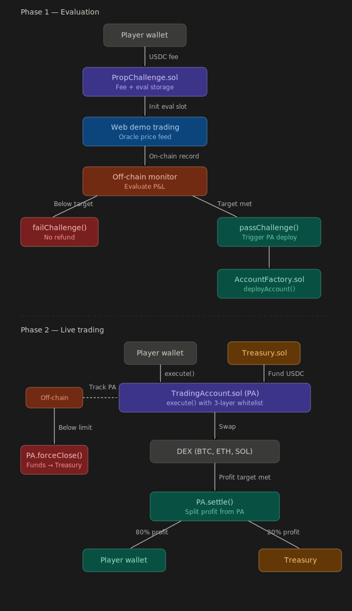

# Monad Prop Trading

온체인 프롭 트레이딩 플랫폼. 트레이더는 USDC 수수료를 납부하고 페이퍼 트레이딩 심사를 통과하면, 플랫폼 자금이 담긴 Performance Account(PA)를 부여받아 실제 DEX 거래를 수행할 수 있습니다.

기존 프롭 펌(FTMO 등)의 구조를 스마트 컨트랙트로 구현해, 트레이더는 자금의 키를 쥐지 않으면서도 거래 권한을 갖는 **trustless 자금 위탁 구조**를 실현합니다.

---

## 전체 흐름



### Phase 1 — Evaluation (심사)

1. 트레이더가 USDC 수수료를 납부하면 온체인에 평가 슬롯이 생성됩니다.
2. 웹 프론트엔드에서 오라클 가격을 기준으로 가상 매매를 진행하며, 각 포지션 개폐가 컨트랙트에 기록됩니다.
3. 팀(플랫폼 오너)이 P&L을 모니터링하다가:
   - 수익 목표 달성 → `passChallenge()` 호출 → PA 자동 배포
   - 손실 한도 초과 → `failChallenge()` 호출 → 환불 없이 종료

### Phase 2 — Live Trading (실거래)

1. AccountFactory가 트레이더 전용 TradingAccount(PA)를 배포합니다.
2. Treasury가 PA에 USDC 운용 자금을 공급합니다.
3. 트레이더는 PA의 `execute()`만 호출할 수 있으며, 이 함수는 **3중 화이트리스트**로 허용된 거래만 통과시킵니다.
4. 수익 목표 달성 시 `settle()` → 80% 트레이더 / 20% Treasury로 분배됩니다.
5. 손실 한도 초과 시 `forceClose()` → 전액 Treasury 회수, 트레이더 권한 박탈됩니다.

---

## 컨트랙트 구조

```
contracts/src/
├── PropChallenge.sol     # 수수료 수납, 페이퍼 트레이딩 기록, 합격/실패 판정
├── AccountFactory.sol    # TradingAccount 배포 및 레지스트리
├── TradingAccount.sol    # Performance Account (PA) — execute() 3중 검증
└── Treasury.sol          # 플랫폼 자금 보관, PA 자금 공급, 수익 출금
```

### 컨트랙트 간 관계

- `PropChallenge` → `passChallenge()` → `AccountFactory.deployAccount()` → `TradingAccount`
- `PropChallenge` fee → `Treasury` → `fundAccount()` → `TradingAccount`
- `TradingAccount` → `settle()` / `forceClose()` → `Treasury`

---

## 기술 스택

| 영역 | 기술 |
|---|---|
| 스마트 컨트랙트 | Solidity 0.8.24, Foundry, OpenZeppelin |
| 프론트엔드 | React 18, TypeScript, ethers.js v6, Tailwind CSS, Vite |
| 체인 | Monad Testnet (EVM 호환, 고처리량, 저지연) |
| 기준 통화 | USDC (ERC-20) |
| 가격 피드 | CoinGecko API (심사 페이즈) |

---

## 디렉토리 구조

```
monad-prop-trading/
├── contracts/
│   ├── src/                  # 컨트랙트 소스
│   ├── test/                 # Foundry 테스트
│   └── script/Deploy.s.sol   # 배포 스크립트
└── frontend/
    └── src/
        ├── components/       # UI 컴포넌트
        ├── hooks/            # useWallet, useContracts, usePrices
        ├── config/           # 컨트랙트 주소, 상수
        ├── abi/              # 컨트랙트 ABI
        └── pages/            # ChallengePage
```

---

## 시작하기

```bash
# 컨트랙트 빌드 및 테스트
cd contracts
forge build
forge test -vvv

# 프론트엔드 실행
cd frontend
cp .env.example .env   # 컨트랙트 주소 입력
npm install
npm run dev
```

---

## 보안 구조 (TradingAccount execute() 3중 검증)

> 이 섹션은 추후 업데이트 예정입니다.
>
> - **어떻게 트레이더가 임의로 자금을 이체하지 못하는가**
> - **화이트리스트 기반으로 DEX 거래만 허용하는 구체적인 메커니즘**
